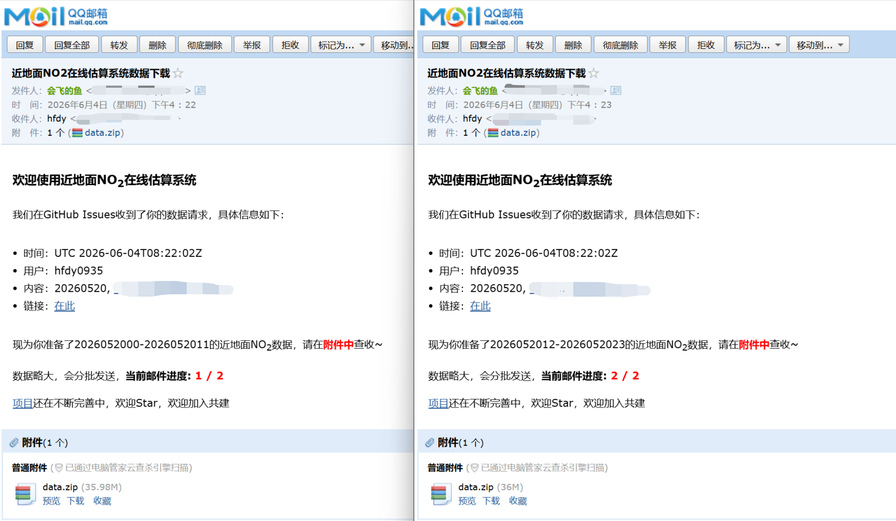
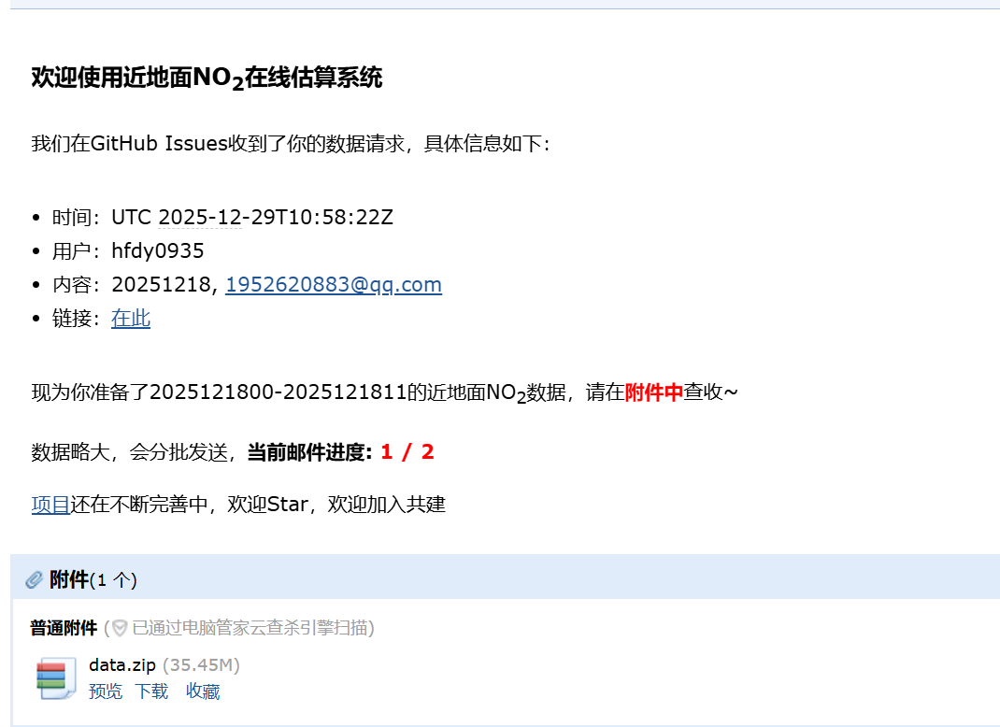

# 近地面时空无缝 $NO_2$ 实时估算系统

## 1. 📁`shared`共享数据目录

包括原始数据、重建结果、估算结果

## 2. ⏰`task`定时任务

| 数据      | cron       | 描述          | 时段            | 分辨率&覆盖范围         | 保存位置                                                                                                                                                                                                                                                                |
| --------- | ---------- | ------------- | --------------- | ----------------------- | ----------------------------------------------------------------------------------------------------------------------------------------------------------------------------------------------------------------------------------------------------------------------- |
| `geoscf`  | 0 9 * * *  | utc每天9:00   | 5天前           | 1h, 0.05°; 24h, china   | `shared/data_source/geoscf/{year}/{ymd}.parquet`                                                                                                                                                                                                                        |
| `era5`    | 0 10 * * * | utc每天10:00  | 7天前           | 1h, 0.05°; 24h, china   | `shared/data_source/era5/{year}/{ymd}.parquet`                                                                                                                                                                                                                          |
| `gems`    | 0 12 * * * | utc每天12:00  | 当天            | 1h, 0.05°; ~0-6h, china | `shared/data_source/gems/{year}/{ymd}.parquet`                                                                                                                                                                                                                          |
| `cnemc`   | 40 * * * * | 每小时40分    | 前24h(查漏补缺) | 1h, station; 24h, china | `shared/data_source/cnemc/{year}/{ymd}.parquet`                                                                                                                                                                                                                         |
| `rec_no2` | /          | 跟随`era5`    | 7天前           | 1h, 0.05°; 24h, china   | `shared/reconstruct/pq/{year}/{ymd}.parquet`                                                                                                                                                                                                                            |
| `est_no2` | /          | 跟随`rec_no2` | 7天前           | 1h, 0.05°; 24h, china   | `shared/estimate/pq/{year}/{ymd}.parquet` `shared/estimate/hourly_tif/{year}/{ymd}/{ymdh}.tif`  `shared/estimate/daily_tif/{year}/{ymd}.tif`  `shared/estimate/stat/{year}/{ymd}/hourly_cnemc_est.parquet`  `shared/estimate/stat/{year}/{ymd}/match_cnemc_est.parquet` |

**文件名都按照utc组织**

## 3. 📈前端展示

**原理**：通过GitHub静态文件url获取结果，并显示

## 4. 数据自助获取

- 监听`issue`，提取邮箱和数据范围，触发action，打包数据发送至该邮箱
- `issue`格式：
  1. 标题为`req_data`
  2. 内容为`yyyymmdd, xxx@xxx.com`，表示想要的数据范围和要发送的邮箱
- 不论成功与否，都会收到`issue`自动回复
- 成功后`issue`会自动关闭
- 目前对触发流程的`用户名`有限制，可以联系作者加白名单

|      流程       |              截图               |
| :-------------: | :-----------------------------: |
| `issue`自动回复 |  |
|      邮件       |  |

## 5. 其他

以下均使用github secret（仓库级）
1. GEMS的`api-key`
2. GEE的认证文件
3. `git push`的token，名为`GITHUB_TOKEN`，actions流程中会自动生成，不用配置
4. 邮箱验证码

## 6. 链接

1️⃣**数据源**\
GEMS： https://nesc.nier.go.kr/en/html/cntnts/73/satellite/introduction.do \
GEE: https://developers.google.cn/earth-engine?hl=zh-cn \
CNEMC: https://air.cnemc.cn:18007/ 

2️⃣**技术栈**\
Vue: https://cn.vuejs.org/ \
Vite: https://vitejs.cn/vite3-cn/guide/ \
AntV L7: https://l7.antv.antgroup.com/tutorial/quickstart \
Naive UI: https://www.naiveui.com/zh-CN/os-theme \
geemap: https://geemap.org/ \
GitHub API 文档：https://docs.github.com/en/rest/issues/comments?apiVersion=2022-11-28 

